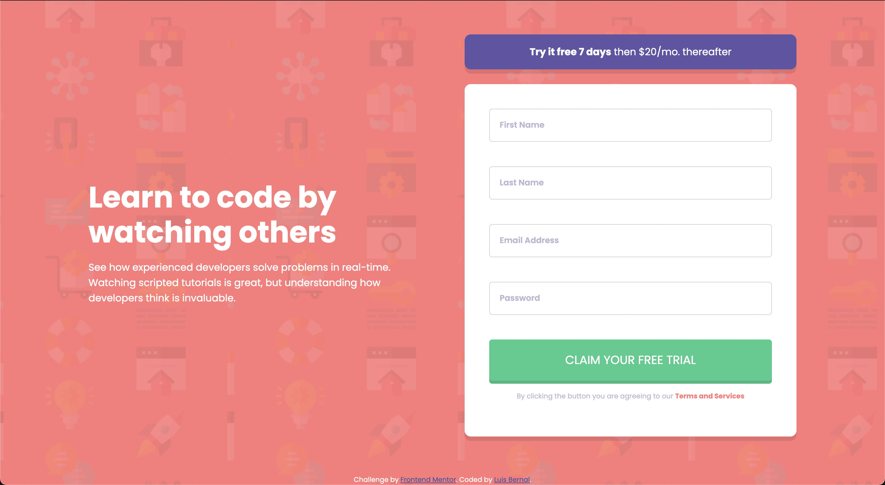

# Frontend Mentor - Intro component with sign up form solution

This is a solution to the [Intro component with sign up form challenge on Frontend Mentor](https://www.frontendmentor.io/challenges/intro-component-with-signup-form-5cf91bd49edda32581d28fd1). Frontend Mentor challenges help you improve your coding skills by building realistic projects.

## Table of contents

- [Overview](#overview)
  - [The challenge](#the-challenge)
  - [Screenshot](#screenshot)
  - [Links](#links)
- [My process](#my-process)
  - [Built with](#built-with)
  - [What I learned](#what-i-learned)
  - [Continued development](#continued-development)
  - [Useful resources](#useful-resources)
- [Author](#author)
- [Acknowledgments](#acknowledgments)

**Note: Delete this note and update the table of contents based on what sections you keep.**

## Overview

### The challenge

Users should be able to:

- View the optimal layout for the site depending on their device's screen size
- See hover states for all interactive elements on the page
- Receive an error message when the `form` is submitted if:
  - Any `input` field is empty. The message for this error should say _"[Field Name] cannot be empty"_
  - The email address is not formatted correctly (i.e. a correct email address should have this structure: `name@host.tld`). The message for this error should say _"Looks like this is not an email"_

### Screenshot

### Links

- Solution URL: [https://github.com/FrontendMentor-Lecap/Intro-Component-with-signup-form-master]
- Live Site URL: [https://frontendmentor-lecap.github.io/Intro-Component-with-signup-form-master]

## My process

### Built with

- Semantic HTML5 markup
- CSS custom properties
- Flexbox
- Mobile-first workflow
- JS Interaction

### What I learned

I continue learning about general positioning and interaction between child and parent elements. In this case, I improved setting an input inside a container in order to insert icons or messages. I figured out that removing the parents padding and increasing the one from the child was the solution I did not thought of during last challenge. I know it is not rocket science but it gave me a sense of self-accomplishment and of true understanding of the front end basics.

I also learned how to add a DIV inside of an anchor tag, as it was set in the "Try it free 7 days..." section. I wanted the user to feel like the whole div was a button and not only text. Again, a small discovery but important to learning HTML and CSS basics.

The last thing I started learning was JS DOM and how to interact with different elements with a single function.

### Continued development

I feel this section could be as long as the bible, since every time I start coding, I recognize the knowledge holes I have. The coding road is very slow and long but it is quite fun and satiating. For this particular project I believe the continue development focuses on Javascript, I would like to feel more comfortable with the language and to increase speed, both of those things will arrive with experience. Nonetheless I keep seeing on the internet that a lot of programmers just copy and paste, or spend most of their time searching google on how to do a specific task. I feel like this whole project was just watching, copying, modifying and pasting. I know it is ok for a start but I will focus on trying to reduce that need to copy in minor tasks. I know how functions work, but having the creativity to invent them in a real project set in another level, practice will make me better.

### Useful resources

- [https://www.youtube.com/watch?v=rsd4FNGTRBw] - This video helped me create all of the Javascript component, I shows step by step how to add validation to each input component and double validation to email. I recommend anyone having issues to watch the video, well explained.
